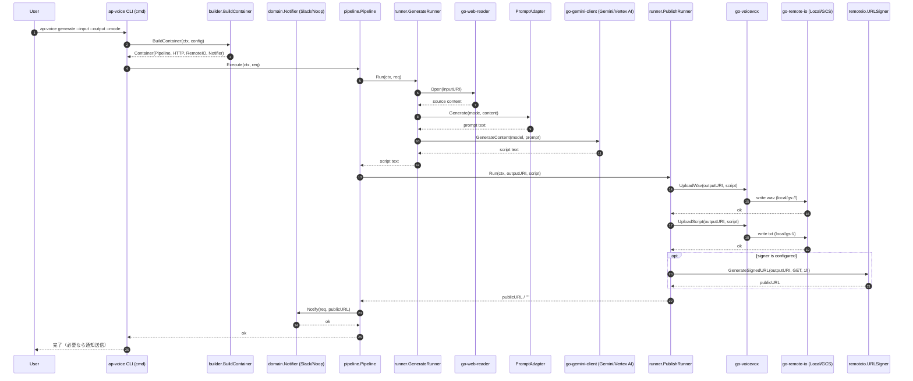

# ✍️ AP Voice

[](https://golang.org/)
[](https://golang.org/)
[](https://github.com/shouni/ap-voice/tags)
[](https://opensource.org/licenses/MIT)

## 💡 概要 (About)— **堅牢なGo並列処理とAIを統合した次世代ドキュメント音声化パイプライン**

**AP Voice** は、独自の **Gemini API クライアントライブラリ** [`shouni/go-gemini-client`](https://github.com/shouni/go-gemini-client) と **Go言語の強力な並列制御**を融合させたCLI ツールです。

長文の技術ドキュメントやWeb記事を、AIが話者とスタイルを明確に指示した**ナレーションスクリプト**に変換し、その台本を **VOICEVOXエンジンで合成**して**最終的な音声ファイル (WAV)** を生成します。

本ツールは **Google Cloud 連携に最適化された I/O 設計**を採用。入力ソースとして **Web URL**、**GCS (`gs://`)** を透過的に扱うことができ、生成された音声も**ローカルまたは GCS** へ直接保存可能です。

## ✨ 主な特徴 (Features)

* **✍️ AI-Driven Scripting**:
    * AIが技術ドキュメントを解析し、最適な話者スタイルを指定したナレーションスクリプトを自動生成。
* **🔗 Cloud Native Input**:
    * Web URL、GCS (`gs://`) からの直接読み込みをサポート。
* **⚡️ High-Speed Parallel Synthesis**:
    * Go言語の並列処理と堅牢なリトライロジックを融合。VOICEVOXエンジンへの高速接続により、長文の音声合成も高い安定性と成功率で完結。
* **🧬 Unified Audio Pipeline**:
    * スクリプト生成からWAV出力、ストレージ保存までを一貫したCLIで完結。複数ツールの連携作業を自動化し、ストレスフリーなドキュメント配信を実現。

---

## ✨ 技術スタック

| 要素 | 技術 / ライブラリ | 役割 |
| :--- | :--- | :--- |
| **言語** | **Go (Golang)** | ツールの開発言語。並列処理と堅牢な実行環境を提供します。 |
| **CLI** | **Cobra** | コマンドライン引数とオプションの解析に使用します。 |

---

## ✨ 主な機能

1. **Webからの自動抽出**: URLから記事タイトルと本文のみを整形してAIに渡します。
2. **マルチソース入力**: Web URL、**GCS (`gs://`)** に対応。
3. **AIスクリプト生成**: **`solo`**, **`dialogue`**, **`duet`** の3形式をサポート。
4. **VOICEVOX並列合成**: 生成された台本を並列処理で高速にWAV化し、連結して出力。
5. **クラウド直接出力**: 生成されたWAVを **GCS (`gs://`)** へ直接保存可能。

---

## 📦 使い方

### 1. 環境設定

| 変数名 | 必須/任意 | 説明 |
| --- | --- | --- |
| `GEMINI_API_KEY` | いずれか必須 | Google AI Studio で取得した API キー。 |
| `GCP_PROJECT_ID` | いずれか必須 | Vertex AI 経由で Gemini を利用する場合の GCP Project ID。 |
| `VOICEVOX_API_URL` | VOICEVOX使用時 | エンジンのURL (例: `http://localhost:50021`)。 |
| `GOOGLE_APPLICATION_CREDENTIALS` | GCS使用時に必要な場合 | GCS権限を持つサービスアカウントのJSONパス（ADC利用時）。 |

### 2. 生成・音声化コマンド

```bash
ap-voice generate [flags]

```

#### フラグ一覧（入力ソースはいずれか一つを指定）

| フラグ | 短縮形 | 説明 |
| --- | --- | --- |
| `--input` | `-i` | **入力ソースURI**。Web URL、GCS (`gs://`)を指定します。 |
| `--output` | `-o` | **出力先URI**。WAVを保存し、同名の `.txt` スクリプトも保存します（例: `out.wav`, `gs://bucket/out.wav`）。 |
| `--mode` | `-m` | 形式: **`solo`**, **`dialogue`**, **`duet`** (Default: `duet`)。 |
| `--model` | `-g` | 使用する Gemini モデル名。 (Default: `gemini-2.5-flash`) |
| `--http-timeout` |  | Webリクエストや合成のタイムアウト時間。 (Default: `60s`) |

> `--input` は必須フラグです。`--output` は必須フラグではありませんが、未指定の場合は実行時エラーになります。

---

## 🔊 実行例

### 例 1: Web記事を対話形式で音声化し、GCSへ保存

```bash
# Webから入力し、生成された音声をGCSへ直接アップロード
ap-voice generate \
    --input "https://example.com/tech-news" \
    --output "gs://my-bucket/audio/tech-news.wav" \
    --mode dialogue

```

### 例 2: GCS上の文書を読み込み、モノローグ化してローカルに保存

```bash
ap-voice generate \
    --input "gs://my-source-bucket/docs/article.md" \
    --output "article.wav" \
    --mode solo

```

---

## 🔄 処理シーケンス図



## 🌳 プロジェクト構成ツリー図

```text
ap-voice/
├── main.go                  # エントリポイント（CLI 起動）
├── cmd/                     # CLI コマンド定義（root / generate）
├── assets/                  # 埋め込みプロンプト管理（prompt_*.md）
└── internal/
    ├── config/              # 設定読み込みとデフォルト値管理
    ├── domain/              # ドメインモデルとポート定義
    ├── app/                 # DI コンテナとリソース管理
    ├── builder/             # 外部依存とパイプライン組み立て
    ├── pipeline/            # Generate/Publish 実行オーケストレーション
    ├── runner/              # 生成処理・公開処理のユースケース実装
    └── adapters/            # Gemini / Prompt / VOICEVOX の実装アダプタ
```

## 🤝 依存関係 (Dependencies)

主要な direct dependency（`go.mod`）:

* **[spf13/cobra](https://github.com/spf13/cobra)**: CLI コマンド/フラグ定義
* **[shouni/clibase](https://github.com/shouni/clibase)**: CLI 実行基盤（共通初期化・実行ラッパー）
* **[shouni/go-gemini-client](https://github.com/shouni/go-gemini-client)**: Gemini / Vertex AI への生成リクエスト
* **[shouni/go-voicevox](https://github.com/shouni/go-voicevox)**: VOICEVOX エンジンによる音声合成
* **[shouni/go-web-reader](https://github.com/shouni/go-web-reader)**: `https://` / `gs://` 入力の読み込み
* **[shouni/go-remote-io](https://github.com/shouni/go-remote-io)**: ローカル/GCS への書き込み抽象化
* **[shouni/go-http-kit](https://github.com/shouni/go-http-kit)**: HTTP クライアント（タイムアウト/リトライ）
* **[shouni/go-prompt-kit](https://github.com/shouni/go-prompt-kit)**: プロンプトテンプレートのロードとレンダリング
* **[shouni/go-utils](https://github.com/shouni/go-utils)**: 環境変数読み込みなどのユーティリティ

実行時の外部依存:

* **Google Gemini API または Vertex AI**: スクリプト生成
* **VOICEVOX Engine** (`VOICEVOX_API_URL`): 音声合成
* **Google Cloud Storage**（任意）: `gs://` 入出力利用時


---

### 📜 ライセンス (License)

* デフォルトキャラクター: VOICEVOX:ずんだもん、VOICEVOX:四国めたん
* このプロジェクトは [MIT License](https://opensource.org/licenses/MIT) の下で公開されています。
