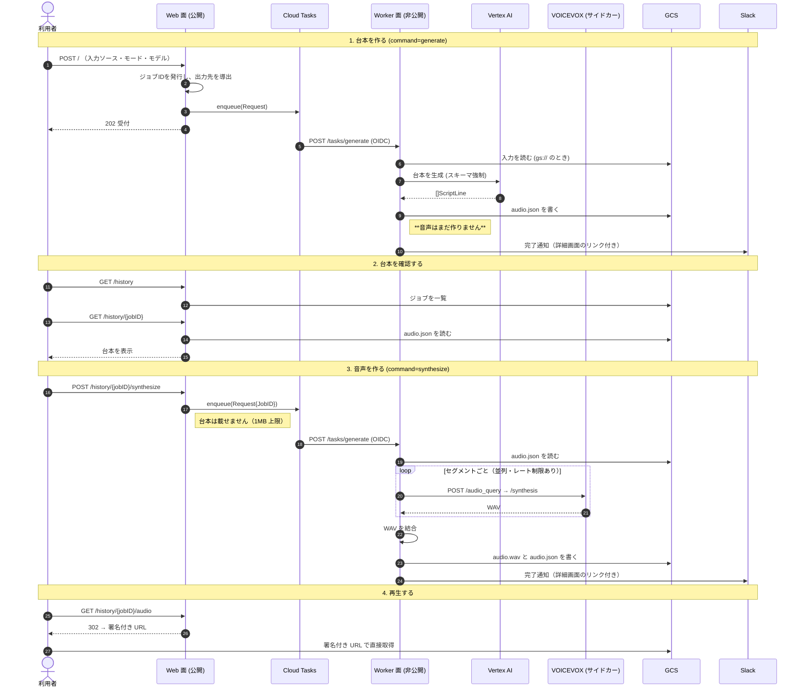

# ✍️ AP Voice

[](https://golang.org/)
[](https://opensource.org/licenses/MIT)
[](#)

## 💡 概要 (About)

**AP Voice** は、ドキュメントをナレーション音声に変換する Cloud Run + Cloud Tasks 上のサービスです。

Web 記事や GCS 上の文書を読み込み、Gemini に**話者とスタイルを指定した台本**（JSON）を生成させます。
**台本と音声は別の工程**です。台本ができたら履歴に並ぶので、内容を確認してから
**VOICEVOX エンジンで並列合成**します。読みや話者を直したければ、生成をやり直さずに
合成だけ何度でもかけ直せます。

1つのイメージを `SERVER_ROLE` で **Web 面（公開）と Worker 面（非公開）の2サービス**として
デプロイします。入出力はどちらも Web URL / GCS (`gs://`) / ローカルを透過的に扱います。

---

## 📦 使い方

### 1. 環境設定

`ValidateEssentialConfig` はロールごとに必要なものだけを検証します。担当しない面の設定を
要求すると、使わない認証情報へのアクセス権を配ることになるためです。

**どのロールでも必須**

| 変数名 | 説明 |
| --- | --- |
| `SERVER_ROLE` | `web` / `worker` / `both`（`both` はローカル開発用）。**未設定・未知の値は起動時エラー**です。担当する面だけを組み立て、ルートもその面のものだけを登録します。 |
| `GEMINI_MODELS` | Gemini モデル名。**カンマ区切りで複数指定でき、先頭が既定モデル**です。タスクの `ai_model` が空ならこれを使います。**既定値は持たず、未設定なら起動時にエラー**になります。 |
| `GCP_PROJECT_ID` | GCP Project ID。**Gemini は Vertex AI 経由でのみ呼びます**（API キー経路は持ちません）。ローカル実行では ADC が必要です。 |

**Web 面（`web` / `both`）で必須**

| 変数名 | 説明 |
| --- | --- |
| `CLOUD_TASKS_QUEUE_ID` | 投入先のキュー名。 |
| `WORKER_URL` | タスクの配信先（Worker 面の `/tasks/generate`）。 |
| `TASK_CALLER_SERVICE_ACCOUNT_EMAIL` | タスクに載せる caller SA。**トークンを発行するのは Cloud Tasks** であって、このプロセスが署名するわけではありません。 |
| `GOOGLE_CLIENT_ID` / `GOOGLE_CLIENT_SECRET` | Google OAuth のクライアント。 |
| `SESSION_SECRET` | セッションの署名鍵。**16バイト以上**。 |
| `SESSION_ENCRYPT_KEY` | セッションの暗号化鍵。AES の要件で **16 / 24 / 32 バイト**のいずれか。 |
| `ALLOWED_EMAILS` / `ALLOWED_DOMAINS` | ログインを許可する相手（カンマ区切り）。**どちらも空だと起動しません。** |

**Worker 面（`worker` / `both`）で必須**

| 変数名 | 説明 |
| --- | --- |
| `TASK_AUDIENCE_URL` | OIDC 検証の audience（Worker 自身の URL）。未設定なら `SERVICE_URL` を使います。 |
| `ALLOWED_TASK_SERVICE_ACCOUNTS` | 受け付ける caller SA（カンマ区切り）。**投入側**の SA を指定します。web/worker で実行 SA を分けるため、worker には「他人の SA」が並びます。 |

**任意**

| 変数名 | 説明 |
| --- | --- |
| `SERVICE_URL` / `PORT` | 公開 URL と待ち受けポート (Default: `http://localhost:8080` / `8080`)。 |
| `VOICEVOX_API_URL` | エンジンの URL。未設定なら `http://localhost:50021` を使います（ローカル実行と Cloud Run のサイドカー構成のどちらもこの値でよいため）。 |
| `VOICEVOX_MAX_PARALLEL_SEGMENTS` | 1ジョブ内で同時に投げるセグメント数 (Default: `8`)。**エンジンがメモリ不足になったらここを vCPU 数まで下げます。** |
| `VOICEVOX_SEGMENT_RATE_LIMIT` | セグメントの投入間隔 (Default: `500ms` = 秒2件)。**スループットを決めているのはこの値です。** |
| `VOICEVOX_SEGMENT_TIMEOUT` | セグメント1件あたりの上限 (Default: `120s`)。 |
| `GCP_LOCATION_ID` | **Cloud Tasks キューのリージョン** (Default: `asia-northeast1`)。Vertex AI のエンドポイントとは別物で、そちらは `global` に固定してあります。 |
| `HTTP_TIMEOUT` | 外部 HTTP 通信のタイムアウト (Default: `60s`)。 |
| `PIPELINE_TIMEOUT` | ジョブ1件の実行上限 (Default: `25m`)。**Cloud Tasks より先にアプリが諦める**ための値で、超えると失敗を通知して終わります。 |
| `TASK_DISPATCH_DEADLINE` | Cloud Tasks がワーカーの応答を待つ上限 (Default: `30m`、Cloud Tasks の上限)。`PIPELINE_TIMEOUT` より長くします。 |
| `SLACK_WEBHOOK_URL` | 完了・失敗の通知先。未設定なら通知は無効になります。 |
| `GOOGLE_APPLICATION_CREDENTIALS` | `gs://` を読み書きする場合のみ（ADC 利用時）。 |

> 環境変数が持つのは**デプロイ先が決める設定**だけです。入力元・出力先・生成モードといった
> 実行ごとに変わる値は、タスクのペイロード（JSON）で渡します。

### 2. 起動

```bash
go run .        # SERVER_ROLE が必須
```

`SERVER_ROLE` が担う面だけを組み立てます。

| ロール | 組み立てるもの | 公開されるルート |
| --- | --- | --- |
| `web` | 投入フォームと Cloud Tasks への投入 | `GET /health`, `GET /`, `POST /`, `/auth/*` |
| `worker` | パイプライン（Gemini + VOICEVOX + GCS + 通知） | `GET /health`, `POST /tasks/generate` |
| `both` | 両方（ローカル開発用） | 上記すべて |

`POST /tasks/generate` は Cloud Tasks 専用で、OIDC 検証を通らないリクエストは 401 になります。
`SERVER_ROLE=web` のプロセスでは**ルートごと登録されない**ため 404 です。

#### タスクのペイロード

**台本生成と音声合成は別の入口です。** 台本は WAV の隣に `.json` で保存される成果物であると
同時に、貼り戻せる入力でもあります。1行の読みを直すたびに Gemini の生成からやり直すと、
費用と待ち時間が無駄になるうえ、直したかった1行以外まで変わってしまいます。

| `command` | 何をするか | 必須フィールド |
| --- | --- | --- |
| `generate` | 入力ソースから台本を作り、そのまま音声まで作る | `input_uri`, `output_uri` |
| `synthesize` | **渡された台本から音声だけ作る**（Gemini を呼ばない） | `script`, `output_uri` |

| フィールド | 説明 |
| --- | --- |
| `command` | `generate` / `synthesize`。**省略できません**（`script` を渡したまま書き忘れると、台本が黙って捨てられて生成が走るため）。 |
| `input_uri` | **入力ソースURI**。Web URL、GCS (`gs://`)を指定します。`generate` で必須。 |
| `output_uri` | **出力先URI**。WAVを保存し、同名の `.json` スクリプトも保存します（例: `out.wav`, `gs://bucket/out.wav`）。 |
| `mode` | 台本の形式。`generate` のみ。**`assets/prompts/<mode>.md` を置けばモードが増えます**（現在は `solo` / `dialogue` / `duet` / `promo`）。 |
| `ai_model` | 使用する Gemini モデル名。空なら `GEMINI_MODELS` の先頭を使います。`generate` のみ。 |
| `script` | 台本（`ScriptLine` の配列）。`synthesize` で必須。保存された `.json` をそのまま貼り戻せます。 |

```json
{
  "command": "generate",
  "input_uri": "https://example.com/tech-news",
  "output_uri": "gs://my-bucket/audio/tech-news.wav",
  "mode": "dialogue"
}
```

```json
{
  "command": "synthesize",
  "output_uri": "gs://my-bucket/audio/tech-news.wav",
  "script": [
    { "speaker": "ずんだもん", "style": "ノーマル", "text": "直した台本なのだ" }
  ]
}
```

---

## 🔄 処理シーケンス図


```mermaid
sequenceDiagram
    autonumber
    actor User as 利用者
    participant Web as Web 面 (公開)
    participant Tasks as Cloud Tasks
    participant Worker as Worker 面 (非公開)
    participant Gemini as Vertex AI
    participant Engine as VOICEVOX (サイドカー)
    participant Store as GCS
    participant Slack as Slack

    Note over User, Slack: 1. 台本を作る (command=generate)
    User->>Web: POST / （入力ソース・モード・モデル）
    Web->>Web: ジョブIDを発行し、出力先を導出
    Web->>Tasks: enqueue(Request)
    Web-->>User: 202 受付
    Tasks->>Worker: POST /tasks/generate (OIDC)
    Worker->>Store: 入力を読む (gs:// のとき)
    Worker->>Gemini: 台本を生成 (スキーマ強制)
    Gemini-->>Worker: []ScriptLine
    Worker->>Store: audio.json を書く
    Note right of Worker: **音声はまだ作りません**
    Worker->>Slack: 完了通知（詳細画面のリンク付き）

    Note over User, Slack: 2. 台本を確認する
    User->>Web: GET /history
    Web->>Store: ジョブを一覧
    User->>Web: GET /history/{jobID}
    Web->>Store: audio.json を読む
    Web-->>User: 台本を表示

    Note over User, Slack: 3. 音声を作る (command=synthesize)
    User->>Web: POST /history/{jobID}/synthesize
    Web->>Tasks: enqueue(Request{JobID})
    Note right of Web: 台本は載せません（1MB 上限）
    Tasks->>Worker: POST /tasks/generate (OIDC)
    Worker->>Store: audio.json を読む
    loop セグメントごと（並列・レート制限あり）
        Worker->>Engine: POST /audio_query → /synthesis
        Engine-->>Worker: WAV
    end
    Worker->>Worker: WAV を結合
    Worker->>Store: audio.wav と audio.json を書く
    Worker->>Slack: 完了通知（詳細画面のリンク付き）

    Note over User, Slack: 4. 再生する
    User->>Web: GET /history/{jobID}/audio
    Web-->>User: 302 → 署名付き URL
    User->>Store: 署名付き URL で直接取得
```

## 🌳 プロジェクト構成ツリー図

```text
ap-voice/
├── main.go                  # エントリポイント（サーバー起動）
├── Dockerfile               # scratch イメージ（静的バイナリのみ）
├── cloudbuild.yaml          # ビルドして2サービスへデプロイ
├── assets/                  # 埋め込み（prompts/*.md・speakers.json・templates/*.html）
└── internal/
    ├── config/              # 環境変数の読み込みとロール別検証
    ├── server/              # chi ルーター・グレースフルシャットダウン
    │   └── handlers/        #   Web 面（投入フォーム・履歴・詳細・再生）
    ├── domain/              # ドメインモデルとポート定義・成果物のパス規約
    ├── app/                 # DI コンテナとリソース管理
    ├── builder/             # 外部依存とハンドラーの組み立て
    ├── repository/          # GCS 上の成果物の読み出し（履歴・台本）
    ├── pipeline/            # command による分岐と各段（step_*.go）
    └── adapters/            # Gemini / VOICEVOX / Cloud Tasks / Slack / プロンプト
```

## 🤝 依存関係 (Dependencies)

主要な direct dependency（`go.mod`）:

* **[go-chi/chi](https://github.com/go-chi/chi)**: HTTP ルーティング
* **[shouni/gcp-kit](https://github.com/shouni/gcp-kit)**: SERVER_ROLE の語彙・Cloud Tasks ハンドラ・OIDC 検証・Cloud Logging
* **[shouni/go-gemini-client](https://github.com/shouni/go-gemini-client)**: Gemini / Vertex AI への生成リクエスト
* **[shouni/go-voicevox](https://github.com/shouni/go-voicevox)**: VOICEVOX エンジンによる音声合成
* **[shouni/go-web-reader](https://github.com/shouni/go-web-reader)**: `https://` / `gs://` 入力の読み込み
* **[shouni/go-remote-io](https://github.com/shouni/go-remote-io)**: ローカル/GCS への書き込み抽象化
* **[shouni/go-http-kit](https://github.com/shouni/go-http-kit)**: HTTP クライアント（タイムアウト/リトライ）
* **[shouni/go-prompt-kit](https://github.com/shouni/go-prompt-kit)**: プロンプトテンプレートのロードとレンダリング
* **[caarlos0/env](https://github.com/caarlos0/env)**: 環境変数から設定構造体への読み込み
* **[shouni/go-utils](https://github.com/shouni/go-utils)**: ログなどのユーティリティ

実行時の外部依存:

* **Vertex AI**: スクリプト生成
* **VOICEVOX Engine** (`VOICEVOX_API_URL`): 音声合成
* **Google Cloud Storage**（任意）: `gs://` 入出力利用時


---

### 📜 ライセンス (License)

* 使用キャラクター: VOICEVOX:ずんだもん、VOICEVOX:四国めたん（対応話者は `go-voicevox/speaker` が定義します）
* このリポジトリは非公開です。コードは [MIT License](https://opensource.org/licenses/MIT) の条件で提供されます。
