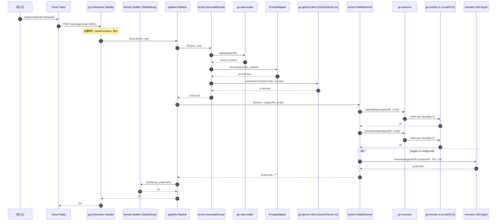

# ✍️ AP Voice

[](https://golang.org/)
[](https://golang.org/)
[](https://github.com/shouni/ap-voice/tags)
[](https://opensource.org/licenses/MIT)
[](#)

## 💡 概要 (About)

**AP Voice** は、ドキュメントをナレーション音声に変換する Cloud Run + Cloud Tasks 上のサービスです。

Web 記事や GCS 上の文書を読み込み、Gemini に**話者とスタイルを指定した台本（JSON）**を生成させ、
その台本を **VOICEVOX エンジンで並列合成**して WAV にまとめ、GCS またはローカルへ書き出します。
台本は WAV の隣に `.json` として保存され、**そのまま貼り戻して合成だけやり直せます**。

1つのイメージを `SERVER_ROLE` で **Web 面（公開）と Worker 面（非公開）の2サービス**として
デプロイします。入出力はどちらも Web URL / GCS (`gs://`) / ローカルを透過的に扱います。

---

## 📦 使い方

### 1. 環境設定

| 変数名 | 必須/任意 | 説明 |
| --- | --- | --- |
| `SERVER_ROLE` | 必須 | `web` / `worker` / `both` のいずれか（`both` はローカル開発用）。**未設定・未知の値は起動時エラー**です。担当する面だけを組み立て、ルートもその面のものだけを登録します。 |
| `TASK_AUDIENCE_URL` | worker で必須 | Cloud Tasks の OIDC 検証で使う audience（worker 自身の URL）。未設定なら `SERVICE_URL` を使います。 |
| `ALLOWED_TASK_SERVICE_ACCOUNTS` | worker で必須 | 受け付ける caller SA（カンマ区切り）。**投入側**の SA を指定します（web/worker で実行 SA を分けるため、worker には「他人の SA」が並びます）。 |
| `SERVICE_URL` | 任意 | サービスの公開 URL (Default: `http://localhost:8080`)。 |
| `PORT` | 任意 | 待ち受けポート (Default: `8080`)。 |
| `GEMINI_MODELS` | 必須 | 使用する Gemini モデル名。**カンマ区切りで複数指定でき、先頭が既定モデル**になります。`--model` / `-g` で上書きできます。**アプリ側に既定値は無く、未設定なら起動時にエラー**になります。 |
| `GCP_PROJECT_ID` | 必須 | GCP Project ID。**Gemini は Vertex AI 経由でのみ呼びます**（API キー経路は持ちません）。ローカル実行では ADC が必要です。 |
| `GCP_LOCATION_ID` | 任意 | Vertex AI のロケーション (Default: `global`)。 |
| `VOICEVOX_API_URL` | 任意 | エンジンのURL (例: `http://localhost:50021`)。未設定なら `http://localhost:50021` を使います。フラグはありません（実行ごとではなくデプロイ先が決める値のため）。 |
| `HTTP_TIMEOUT` | 任意 | 外部 HTTP 通信のタイムアウト (Default: `60s`)。 |
| `SLACK_WEBHOOK_URL` | 任意 | 完了・失敗の通知先。未設定なら通知は無効になります。 |
| `GOOGLE_APPLICATION_CREDENTIALS` | GCS使用時に必要な場合 | GCS権限を持つサービスアカウントのJSONパス（ADC利用時）。 |

> 環境変数が持つのは**デプロイ先が決める設定**だけです。入力元・出力先・生成モードといった
> 実行ごとに変わる値は、タスクのペイロード（JSON）で渡します。

### 2. 起動

```bash
go run .        # SERVER_ROLE が必須
```

`SERVER_ROLE` が担う面だけを組み立てます。

| ロール | 組み立てるもの | 公開されるルート |
| --- | --- | --- |
| `web` | （次のコミットで投入フォームを追加） | `GET /health` |
| `worker` | パイプライン（Gemini + VOICEVOX + GCS + 通知） | `GET /health`, `POST /tasks/generate` |
| `both` | 両方（ローカル開発用） | 上記すべて |

`POST /tasks/generate` は Cloud Tasks 専用で、OIDC 検証を通らないリクエストは 401 になります。
`SERVER_ROLE=web` のプロセスでは**ルートごと登録されない**ため 404 です。

#### タスクのペイロード

**台本生成と音声合成は別の入口です。** 台本は成果物であると同時に入力でもあり
（WAV の隣に `.json` で保存されます）、読みや話者を直して**合成だけやり直したい**ことが
普通に起こるためです。1つの入口しか無いと、そのたびに Gemini の生成からやり直すことになり、
費用と待ち時間が無駄になるうえ、直したかった1行以外まで別物になってしまいます。

| `command` | 何をするか | 必須フィールド |
| --- | --- | --- |
| `generate` | 入力ソースから台本を作り、そのまま音声まで作る | `input_uri`, `output_uri` |
| `synthesize` | **渡された台本から音声だけ作る**（Gemini を呼ばない） | `script`, `output_uri` |

| フィールド | 説明 |
| --- | --- |
| `command` | `generate` / `synthesize`。**省略できません**（`script` を渡したまま書き忘れると、台本が黙って捨てられて生成が走るため）。 |
| `input_uri` | **入力ソースURI**。Web URL、GCS (`gs://`)を指定します。`generate` で必須。 |
| `output_uri` | **出力先URI**。WAVを保存し、同名の `.json` スクリプトも保存します（例: `out.wav`, `gs://bucket/out.wav`）。 |
| `mode` | 形式: **`solo`**, **`dialogue`**, **`duet`**。`generate` のみ。`assets/prompts/<mode>.md` を置けばモードが増えます。 |
| `ai_model` | 使用する Gemini モデル名。空なら `GEMINI_MODELS` の先頭を使います。`generate` のみ。 |
| `script` | 台本（`ScriptLine` の配列）。`synthesize` で必須。保存された `.json` をそのまま貼り戻せます。 |

```json
{
  "command": "generate",
  "input_uri": "https://example.com/tech-news",
  "output_uri": "gs://my-bucket/audio/tech-news.wav",
  "mode": "dialogue"
}
```

```json
{
  "command": "synthesize",
  "output_uri": "gs://my-bucket/audio/tech-news.wav",
  "script": [
    { "speaker": "ずんだもん", "style": "ノーマル", "text": "直した台本なのだ" }
  ]
}
```

---

## 🔄 処理シーケンス図


```mermaid
sequenceDiagram
    autonumber
    participant Caller as 投入元
    participant Tasks as Cloud Tasks
    participant Worker as gcp-kit/worker Handler
    participant Notifier as domain.Notifier (Slack/Noop)
    participant Pipeline as pipeline.Pipeline
    participant GenRunner as runner.GenerateRunner
    participant Reader as go-web-reader
    participant Prompt as PromptAdapter
    participant Gemini as go-gemini-client (Gemini/Vertex AI)
    participant PubRunner as runner.PublishRunner
    participant Voice as go-voicevox
    participant Store as go-remote-io (Local/GCS)
    participant Signer as remoteio.URLSigner

    Caller->>Tasks: enqueue(domain.Request)
    Tasks->>Worker: POST /tasks/generate (OIDC)
    Note over Worker: 起動時に BuildContainer 済み

    Worker->>Pipeline: Execute(ctx, req)
    Pipeline->>GenRunner: Run(ctx, req)
    GenRunner->>Reader: Open(inputURI)
    Reader-->>GenRunner: source content
    GenRunner->>Prompt: Generate(mode, content)
    Prompt-->>GenRunner: prompt text
    GenRunner->>Gemini: GenerateContent(model, prompt)
    Gemini-->>GenRunner: script text
    GenRunner-->>Pipeline: script text

    Pipeline->>PubRunner: Run(ctx, outputURI, script)
    PubRunner->>Voice: UploadWav(outputURI, script)
    Voice->>Store: write wav (local/gs://)
    Store-->>PubRunner: ok
    PubRunner->>Voice: UploadScript(outputURI, script)
    Voice->>Store: write json (local/gs://)
    Store-->>PubRunner: ok
    opt signer is configured
        PubRunner->>Signer: GenerateSignedURL(outputURI, GET, 1h)
        Signer-->>PubRunner: publicURL
    end
    PubRunner-->>Pipeline: publicURL / ""
    Pipeline->>Notifier: Notify(req, publicURL)
    Notifier-->>Pipeline: ok
    Pipeline-->>Worker: ok
    Worker-->>Tasks: 2xx
```

## 🌳 プロジェクト構成ツリー図

```text
ap-voice/
├── main.go                  # エントリポイント（サーバー起動）
├── assets/                  # 埋め込みリソース（prompts/*.md・speakers.json）
└── internal/
    ├── config/              # 環境変数の読み込みと検証（SERVER_ROLE を含む）
    ├── server/              # chi ルーター・グレースフルシャットダウン
    ├── domain/              # ドメインモデルとポート定義
    ├── app/                 # DI コンテナとリソース管理
    ├── builder/             # 外部依存とパイプライン組み立て
    ├── pipeline/            # command による分岐と publish/notify のオーケストレーション
    ├── runner/              # 台本生成・公開処理のユースケース実装
    └── adapters/            # Gemini / Prompt / VOICEVOX の実装アダプタ
```

## 🤝 依存関係 (Dependencies)

主要な direct dependency（`go.mod`）:

* **[go-chi/chi](https://github.com/go-chi/chi)**: HTTP ルーティング
* **[shouni/gcp-kit](https://github.com/shouni/gcp-kit)**: SERVER_ROLE の語彙・Cloud Tasks ハンドラ・OIDC 検証・Cloud Logging
* **[shouni/go-gemini-client](https://github.com/shouni/go-gemini-client)**: Gemini / Vertex AI への生成リクエスト
* **[shouni/go-voicevox](https://github.com/shouni/go-voicevox)**: VOICEVOX エンジンによる音声合成
* **[shouni/go-web-reader](https://github.com/shouni/go-web-reader)**: `https://` / `gs://` 入力の読み込み
* **[shouni/go-remote-io](https://github.com/shouni/go-remote-io)**: ローカル/GCS への書き込み抽象化
* **[shouni/go-http-kit](https://github.com/shouni/go-http-kit)**: HTTP クライアント（タイムアウト/リトライ）
* **[shouni/go-prompt-kit](https://github.com/shouni/go-prompt-kit)**: プロンプトテンプレートのロードとレンダリング
* **[caarlos0/env](https://github.com/caarlos0/env)**: 環境変数から設定構造体への読み込み
* **[shouni/go-utils](https://github.com/shouni/go-utils)**: ログなどのユーティリティ

実行時の外部依存:

* **Vertex AI**: スクリプト生成
* **VOICEVOX Engine** (`VOICEVOX_API_URL`): 音声合成
* **Google Cloud Storage**（任意）: `gs://` 入出力利用時


---

### 📜 ライセンス (License)

* 使用キャラクター: VOICEVOX:ずんだもん、VOICEVOX:四国めたん（対応話者は `go-voicevox/speaker` が定義します）
* このプロジェクトは [MIT License](https://opensource.org/licenses/MIT) の下で公開されています。
