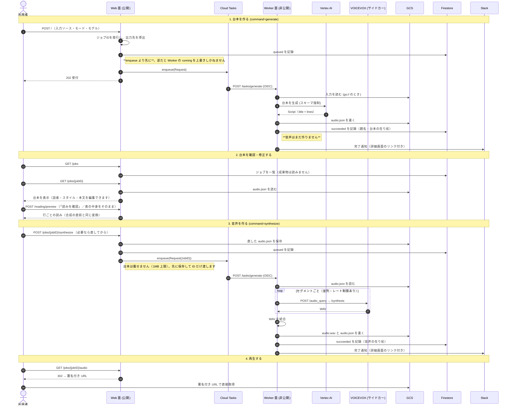

# ✍️ AP Voice

[](https://github.com/shouni/ap-voice/actions/workflows/ci.yml)
[](#)
[](https://go.dev/)
[](https://cloud.google.com/run)
[](https://opensource.org/licenses/MIT)

## 🚀 概要 (About) - 台本を先に作り、確認してから声にする

**AP Voice** は、ドキュメントをナレーション音声に変換する Cloud Run + Cloud Tasks 上のサービスです。

Web 記事や GCS 上の文書を読み込み、Gemini に**話者とスタイルを指定した台本**（JSON）を生成させます。
**台本と音声は別の工程**です。台本ができたら履歴に並ぶので、内容を確認してから
**VOICEVOX エンジンで並列合成**します。読みや話者を直したければ、生成をやり直さずに
合成だけ何度でもかけ直せます。

1つのイメージを `SERVER_ROLE` で **Web 面（公開）と Worker 面（非公開）の2サービス**として
デプロイします。入出力はどちらも Web URL / GCS (`gs://`) / ローカルを透過的に扱います。

---

## 📦 使い方

### 1. 環境設定

`ValidateEssentialConfig` はロールごとに必要なものだけを検証します。担当しない面の設定を
要求すると、使わない認証情報へのアクセス権を配ることになるためです。

**どのロールでも必須**

| 変数名 | 説明 |
| --- | --- |
| `SERVER_ROLE` | `web` / `worker` / `both`（`both` はローカル開発用）。**未設定・未知の値は起動時エラー**です。担当する面だけを組み立て、ルートもその面のものだけを登録します。 |
| `GEMINI_MODELS` | Gemini モデル名。**カンマ区切りで複数指定でき、先頭が既定モデル**です。タスクの `ai_model` が空ならこれを使います。**既定値は持たず、未設定なら起動時にエラー**になります。 |
| `GCP_PROJECT_ID` | GCP Project ID。**Gemini は Vertex AI 経由でのみ呼びます**（API キー経路は持ちません）。ローカル実行では ADC が必要です。 |
| `GCS_VOICE_BUCKET` | 台本と音声の置き場。出力先は利用者に入力させず、ジョブ ID から `gs://<bucket>/voice/<jobID>/audio.wav` を導きます。web は履歴の表示に、worker は保存済み台本の読み出しに使うため、**どちらのロールでも必須**です。 |

**Web 面（`web` / `both`）で必須**

| 変数名 | 説明 |
| --- | --- |
| `CLOUD_TASKS_QUEUE_ID` | 投入先のキュー名。 |
| `WORKER_URL` | worker **サービス**の URL。パスは含めません |
| `TASK_CALLER_SERVICE_ACCOUNT_EMAIL` | タスクに載せる caller SA。**トークンを発行するのは Cloud Tasks** であって、このプロセスが署名するわけではありません。 |
| `GOOGLE_CLIENT_ID` / `GOOGLE_CLIENT_SECRET` | Google OAuth のクライアント。 |
| `SESSION_FIRESTORE_DATABASE` / `SESSION_FIRESTORE_COLLECTION` | セッションを置く Firestore（既定はどちらも `sessions`）。**ジョブ状態用とは別のデータベースを指します** |
| `ALLOWED_EMAILS` / `ALLOWED_DOMAINS` | ログインを許可する相手（カンマ区切り）。**どちらも空だと起動しません。** |
| `ALLOWED_M2M_SERVICE_ACCOUNTS` | 機械（MCP サーバーなど）が OIDC Bearer で叩くときに許可する SA（カンマ区切り）。**任意** — 空なら M2M 検証は常に失敗し、すべてセッション認証に落ちます。 |

**Worker 面（`worker` / `both`）で必須**

| 変数名 | 説明 |
| --- | --- |
| `TASK_AUDIENCE_URL` | OIDC 検証の audience（Worker 自身の URL）。未設定なら `SERVICE_URL` を使います。 |
| `ALLOWED_TASK_SERVICE_ACCOUNTS` | 受け付ける caller SA（カンマ区切り）。**投入側**の SA を指定します。web/worker で実行 SA を分けるため、worker には「他人の SA」が並びます。 |

**任意**

| 変数名 | 説明 |
| --- | --- |
| `SERVICE_URL` / `PORT` | 公開 URL と待ち受けポート (Default: `http://localhost:8080` / `8080`)。 |
| `VOICEVOX_API_URL` | エンジンの URL。未設定なら `http://localhost:50021` を使います（ローカル実行と Cloud Run のサイドカー構成のどちらもこの値でよいため）。 |
| `VOICEVOX_MAX_PARALLEL_SEGMENTS` | 1ジョブ内で同時に投げるセグメント数 (Default: `4` = エンジンの vCPU 数)。**スループットを縛っているのはこの値です。** 合成は CPU バウンドなので 4 vCPU は同時4本で飽和し、実測でも 8 にするとスループットは横ばいのまま1件あたりの所要が倍になりました。上書きは戻すための口です。 |
| `VOICEVOX_SEGMENT_RATE_LIMIT` | セグメントの投入間隔 (Default: `100ms`)。**スループットのつまみではありません**（実測の実効 0.24 件/秒 に対し、100ms は 10 件/秒 を許容）。起動時にエンジンを一斉に叩かないための保険で、同時実行数を縛るのは `VOICEVOX_MAX_PARALLEL_SEGMENTS` です。 |
| `VOICEVOX_SEGMENT_TIMEOUT` | セグメント1件あたりの上限 (Default: `120s`)。**「1件」はクエリと合成の2往復ぶん**で、各往復は 1 回までリトライします。1往復ぶんの上限は `HTTP_TIMEOUT` です。 |
| `GCP_LOCATION_ID` | **Cloud Tasks キューのリージョン** (Default: `asia-northeast1`)。Vertex AI のエンドポイントとは別物で、そちらは `global` に固定してあります。 |
| `FIRESTORE_DATABASE` | ジョブ状態を置く Firestore データベース名 (Default: `job-status`)。名前付きを使うのは `(default)` の枠を占めないためです。コレクション名は設定にしません（サービスの身元であってデプロイごとに変わらないため）。 |
| `HTTP_TIMEOUT` | 外部 HTTP 通信（**HTTP 1往復**）のタイムアウト (Default: `60s`)。セグメント1件の上限（`VOICEVOX_SEGMENT_TIMEOUT`）の半分にしてあります — 同じ値まで上げると、最初の1往復がセグメントの持ち時間を使い切ってリトライが入らなくなります。1往復を延ばしたいときにセグメント側を上げても効きません（小さいほうが先に効きます）。Slack への通知も同じクライアントを使うため、応答が無いときの待ち時間もこの値です。 |
| `PIPELINE_TIMEOUT` | ジョブ1件の実行上限 (Default: `25m`)。**Cloud Tasks より先にアプリが諦める**ための値で、超えると失敗を通知して終わります。 |
| `TASK_DISPATCH_DEADLINE` | Cloud Tasks がワーカーの応答を待つ上限 (Default: `30m`、Cloud Tasks の上限)。`PIPELINE_TIMEOUT` より長くします。 |
| `AP_MUSIC_BUCKET` | 楽曲レシピ（`music.Recipe` 形式の `recipe.json`）の置き場 (Default: `ap-music`)。作成画面の「楽曲レシピ」タブが、楽曲生成サービスのジョブ ID から `gs://<bucket>/music/<jobID>/recipe.json` を組み立てるために使います。**動画生成サービスと同じ変数名・同じ規則です。** |
| `SLACK_WEBHOOK_URL` | 完了・失敗の通知先。未設定なら通知は無効になります。 |
| `GOOGLE_APPLICATION_CREDENTIALS` | `gs://` を読み書きする場合のみ（ADC 利用時）。 |

> 環境変数が持つのは**デプロイ先が決める設定**だけです。入力元・出力先・生成モードといった
> 実行ごとに変わる値は、タスクのペイロード（JSON）で渡します。

### 2. 起動

```bash
go run .        # SERVER_ROLE が必須
```

`SERVER_ROLE` が担う面だけを組み立てます。

| ロール | 組み立てるもの | 公開されるルート |
| --- | --- | --- |
| `web` | 投入フォーム・モード一覧・履歴画面・Cloud Tasks への投入 | `/`, `/modes/*`, `/speakers`, `/reading/preview`, `/jobs/*`, `/auth/*` |
| `worker` | パイプライン（Gemini + VOICEVOX + GCS + 通知） | `POST /tasks/generate` |
| `both` | 両方（ローカル開発用） | 上記すべて |

### 3. HTTP エンドポイント

**認証は 1 つです。** `auth.Protected` が OIDC の Bearer とセッションの両方を通すため、
同じ URL を人も機械も叩けます（姉妹サービスと同じ形）。`GET /health` と `/static/*` だけが
認証の外側で、ロールに関係なく登録されます。

| メソッド | パス | 用途 |
| --- | --- | --- |
| `GET` | `/health` | ヘルスチェック（`/healthz` は Cloud Run の既定ドメイン側で予約パス扱いになりコンテナまで届かないため使いません）。認証不要 |
| `GET` | `/static/*` | 埋め込みの CSS / JS と `vendor/` 配下の Bootstrap。認証不要。バージョンがパスに入る `vendor/` は `public, max-age=31536000, immutable`、URL が変わらない自前アセットは `public, max-age=300, must-revalidate` |
| `GET` | `/auth/login` `/auth/callback` `/auth/logout` | Google OAuth のログイン・コールバック・ログアウト |
| `GET` | `/` | 投入フォーム（入力ソース / 楽曲レシピ / 台本 JSON の 3 タブ） |
| `GET` | `/modes` | 選べるモードの一覧（キー・表示名・説明）。front matter が唯一の出所です |
| `GET` | `/modes/{mode}` | モード 1 つの詳細。**実際に Gemini へ渡るプロンプト本文**（partial 展開済み）を見せます。一覧に無いキーは 404 |
| `GET` | `/speakers` | 話者ごとに使えるスタイル。**実在しない組み合わせは保存時に弾かれる**ので、選ぶ前にここを見ます |
| `POST` | `/reading/preview` | **合成したらどう読まれるか**を行ごとに返します（合成はしません）。「水面」は ミナモ ではなく スイメン です。編集画面の「読みを確認」と機械の両方が使います |
| `POST` | `/jobs` | ジョブを投入。本文がフォームなら画面の 3 タブ、JSON なら機械です。JSON の `command` は `generate` / `generate_and_synthesize`（入力ソースから AI に書かせる）/ `synthesize`（`script` を渡して自分の台本を喋らせる。Gemini を呼びません）。受付は `202` と `Location: /jobs/{jobID}` |
| `GET` | `/jobs` | ジョブを新しい順に。`?page=` / `?per_page=`（既定・上限とも 100）/ `?state=`（`queued` / `running` / `succeeded` / `failed`）。1 件ごとに `state` が付くので、実行中と失敗を 1 件ずつ引かずに見分けられます。**`?state=` は Firestore の複合索引（`state` 昇順 + `queued_at` 降順）が要ります** — 索引が無い環境では絞り込んだときだけ失敗します |
| `GET` | `/jobs/{jobID}` | ジョブ 1 件。投入から削除まで同じ URL です。ブラウザには詳細画面（**台本をここで直します** — 行の追加・並べ替え・削除、読みの確認。台本がまだ無いジョブでも開き、記録された状態と失敗理由を出します）。`Accept: application/json` には進行状況（`queued` / `running` / `succeeded` / `failed`）と、成果物の在り処（`audio_uri` / `script_uri`）、台本を作ったときの `mode` / `input_uri` / `ai_model`（作り直しに使います）。**記録が無ければ 404** で、呼び出し側は `unknown` として扱います。詳細画面の自動更新と機械のポーリングが同じものを読みます |
| `DELETE` | `/jobs/{jobID}` | 成果物をまとめて削除。画面の削除ボタンも fetch で DELETE を送ります。成果物を 1 つも持たないジョブ（台本を書く前に失敗したもの）は記録だけを消します。記録も無ければ 404 |
| `GET` | `/jobs/{jobID}/audio` | 音声の**再生できるリンク**（署名付き URL、1 時間）。ブラウザには 302、`Accept: application/json` には URL そのものを返します。状態や一覧には載せません — 期限があり、ポーリングのたびに発行するのは無駄なためです。音声が無ければ 404 |
| `GET` | `/jobs/{jobID}/script` | **保存済み**の台本。ブラウザから開くと `<jobID>.json` として落ちます。小さな JSON なので、音声と違って署名付き URL を挟まずそのまま返します |
| `PUT` | `/jobs/{jobID}/script` | 台本を差し替え。**合成はしません**（何度か直してから 1 度だけ合成できます） |
| `POST` | `/jobs/{jobID}/synthesize` | 音声を作る。JSON（本文なし）は保存済みの台本から。フォーム（編集画面のボタン）は編集中の台本を保存してから。**台本はタスクに載せません**（先に保存してジョブ ID だけを渡します）。`202` と `Location` |
| `POST` | `/jobs/{jobID}/regenerate` | **同じ入力ソースから台本を作り直す**。入力ソースは記録から復元するので貼り直し不要です。ジョブ ID は変わりません |
| `POST` | `/tasks/generate` | Cloud Tasks 専用のワーカー。OIDC 検証を通らないリクエストは 401、`SERVER_ROLE=web` では**ルートごと登録されない**ため 404 |

**同じリソースはルートも 1 本です。** 表現は `Accept` で決まり、`application/json` を送れば
JSON が、ブラウザの `Accept` なら画面が返ります。エラー本文も同じ判定で `{"error": "..."}`
になります。

**`/api/` 接頭辞は持ちません。** 人と機械の違いは本文の形（フォームか JSON か）と `Accept` で
吸収し、URL は 1 本です。パスの切り方は public-docs の URL 命名規約に従います。

**副作用のあるメソッドには CSRF トークンが要ります。** フォームは `csrf_token` の hidden で、
画面の JS は `X-CSRF-Token` ヘッダーで送ります。OIDC Bearer で認証した機械はこの検証に入りません
（CSRF はクッキーの自動送出を悪用する攻撃への対策で、Bearer を明示的に付ける呼び出しには
当てはまらないためです。代わりに `ALLOWED_M2M_SERVICE_ACCOUNTS` で呼び出し元を絞ります）。

台本の検証（話者・スタイルが実在するか、行数の上限）は、画面も API も**同じ関数**を通ります。

### 4. タスクのペイロード

台本生成と音声合成は別の入口です（理由は[概要](#-概要-about)のとおり）。

| `command` | 何をするか | 必須フィールド |
| --- | --- | --- |
| `generate` | 入力ソースから台本を作る。**音声は作りません** | `input_uri`, `output_uri` |
| `synthesize` | 保存済みの台本から音声を作る（Gemini を呼ばない） | `output_uri`, `job_id` |
| `generate_and_synthesize` | 台本を作ってそのまま音声まで作る。**確認を挟みません** | `input_uri`, `output_uri` |

| フィールド | 説明 |
| --- | --- |
| `command` | `generate` / `synthesize` / `generate_and_synthesize`。**省略できません**（台本を持ち込んだまま書き忘れると、その台本が黙って捨てられて生成が走るため）。 |
| `input_uri` | **入力ソースURI**。Web URL、GCS (`gs://`)を指定します。`generate` で必須。 |
| `job_id` | ジョブの識別子。成果物の置き場もこれで決まります。`synthesize` では保存済み台本の在り処でもあり、**必須**です。 |
| `output_uri` | **WAV の出力先URI**。台本は拡張子だけ `.json` に替えた隣に置かれます。Web 面から投入する場合は入力しません（ジョブ ID から `gs://<bucket>/voice/<jobID>/audio.wav` を導きます）。 |
| `mode` | 台本の形式。`generate` のみ。**`assets/prompts/<ジャンル>_<形式>.md` を置けばモードが増えます。** 表示名と説明はファイル冒頭の front matter（`label` / `direction` / `use_when`）から出ます。選択肢の並びは同じ front matter の `order`（10 刻み、小さいほうが先）で決まります。<br>一覧は `GET /modes` で見られます。 |
| `ai_model` | 使用する Gemini モデル名。空なら `GEMINI_MODELS` の先頭を使います。`generate` のみ。 |

```json
{
  "command": "generate",
  "input_uri": "https://example.com/tech-news",
  "output_uri": "gs://my-bucket/audio/tech-news.wav",
  "mode": "tech_dialogue"
}
```

```json
{
  "command": "synthesize",
  "job_id": "voice-20260814-020913-b1b8b2f9e8d7",
  "output_uri": "gs://my-bucket/voice/voice-20260814-020913-b1b8b2f9e8d7/audio.wav"
}
```

**台本はペイロードに載りません。** 長い台本は Cloud Tasks の 1MB 上限に当たりうるため、
投入側が先に保存して `job_id` だけを渡します。自分で書いた台本を喋らせる場合も同じで、
`POST /jobs`（JSON で `command: "synthesize"` と `script`）か画面の「台本 JSON」タブへ渡すと、
そこで保存されてからこの形のタスクになります。

---

## 🔄 処理シーケンス図


```mermaid
sequenceDiagram
    autonumber
    actor User as 利用者
    participant Web as Web 面 (公開)
    participant Tasks as Cloud Tasks
    participant Worker as Worker 面 (非公開)
    participant Gemini as Vertex AI
    participant Engine as VOICEVOX (サイドカー)
    participant Store as GCS
    participant State as Firestore
    participant Slack as Slack

    Note over User, Slack: 1. 台本を作る (command=generate)
    User->>Web: POST / （入力ソース・モード・モデル）
    Web->>Web: ジョブIDを発行し、出力先を導出
    Web->>State: queued を記録
    Note right of Web: **enqueue より先に**。逆だと Worker の running を上書きしかねません
    Web->>Tasks: enqueue(Request)
    Web-->>User: 202 受付
    Tasks->>Worker: POST /tasks/generate (OIDC)
    Worker->>Store: 入力を読む (gs:// のとき)
    Worker->>Gemini: 台本を生成 (スキーマ強制)
    Gemini-->>Worker: Script（title + lines）
    Worker->>Store: audio.json を書く
    Worker->>State: succeeded を記録（題名・台本の在り処）
    Note right of Worker: **音声はまだ作りません**
    Worker->>Slack: 完了通知（詳細画面のリンク付き）

    Note over User, Slack: 2. 台本を確認・修正する
    User->>Web: GET /jobs
    Web->>State: ジョブを一覧（成果物は読みません）
    User->>Web: GET /jobs/{jobID}
    Web->>Store: audio.json を読む
    Web-->>User: 台本を表示（話者・スタイル・本文を編集できます）
    User->>Web: POST /reading/preview （「読みを確認」／表の中身をそのまま）
    Web-->>User: 行ごとの読み（合成の直前と同じ変換）

    Note over User, Slack: 3. 音声を作る (command=synthesize)
    User->>Web: POST /jobs/{jobID}/synthesize （必要なら直してから）
    Web->>Store: 直した audio.json を保存
    Web->>State: queued を記録
    Web->>Tasks: enqueue(Request{JobID})
    Note right of Web: 台本は載せません（1MB 上限）。先に保存して ID だけ渡します
    Tasks->>Worker: POST /tasks/generate (OIDC)
    Worker->>Store: audio.json を読む
    loop セグメントごと（並列・レート制限あり）
        Worker->>Engine: POST /audio_query → /synthesis
        Engine-->>Worker: WAV
    end
    Worker->>Worker: WAV を結合
    Worker->>Store: audio.wav と audio.json を書く
    Worker->>State: succeeded を記録（音声の在り処）
    Worker->>Slack: 完了通知（詳細画面のリンク付き）

    Note over User, Slack: 4. 再生する
    User->>Web: GET /jobs/{jobID}/audio
    Web-->>User: 302 → 署名付き URL
    User->>Store: 署名付き URL で直接取得
```

## 🌳 プロジェクト構成ツリー図

```text
ap-voice/
├── main.go                  # エントリポイント（サーバー起動）
├── Dockerfile               # scratch イメージ（静的バイナリのみ）
├── cloudbuild.yaml          # ビルドして2サービスへデプロイ
├── assets/                  # 埋め込み（prompts/*.md・speakers.json・templates/*.html・static/）
│                            #   static/js は app.js（全画面）＋ 画面ごと（handlers の pageScripts）
└── internal/
    ├── config/              # 環境変数の読み込みとロール別検証
    ├── server/              # chi ルーター・グレースフルシャットダウン
    │   └── handlers/        #   Web 面（投入フォーム・履歴・詳細・再生）
    ├── domain/              # ドメインモデルとポート定義・成果物のパス規約
    ├── app/                 # DI コンテナとリソース管理
    ├── builder/             # 外部依存とハンドラーの組み立て
    ├── repository/          # 成果物の読み出し（台本）とジョブ状態の読み書き（履歴）
    ├── pipeline/            # ワーカー本体。planner.go が command から工程列を決め、各工程は step_*.go
    └── adapters/            # Gemini / VOICEVOX / Cloud Tasks / Slack / プロンプト
```

---

### 📜 ライセンス (License)

* 使用キャラクター: VOICEVOX:ずんだもん、VOICEVOX:四国めたん、VOICEVOX:春日部つむぎ ほか
  （**使える話者は `assets/speakers.json`** = エンジンの `/speakers` 応答が決めます。
  ライブラリ側は一覧を持ちません）
* このプロジェクトは [MIT License](https://opensource.org/licenses/MIT) の下で公開されています。
