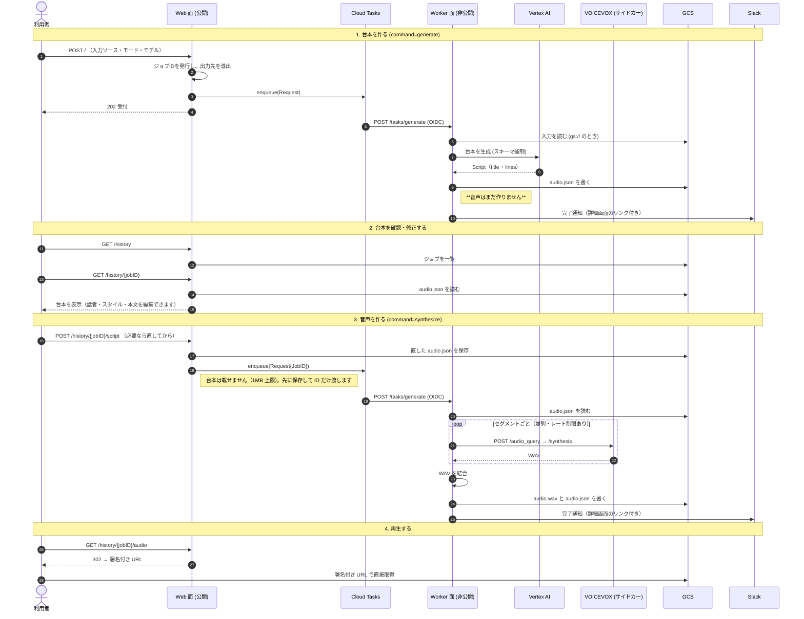

# ✍️ AP Voice

[](https://github.com/shouni/ap-voice/actions/workflows/ci.yml)
[](#)
[](https://golang.org/)
[](https://cloud.google.com/run)
[](https://opensource.org/licenses/MIT)

## 💡 概要 (About)

**AP Voice** は、ドキュメントをナレーション音声に変換する Cloud Run + Cloud Tasks 上のサービスです。

Web 記事や GCS 上の文書を読み込み、Gemini に**話者とスタイルを指定した台本**（JSON）を生成させます。
**台本と音声は別の工程**です。台本ができたら履歴に並ぶので、内容を確認してから
**VOICEVOX エンジンで並列合成**します。読みや話者を直したければ、生成をやり直さずに
合成だけ何度でもかけ直せます。

1つのイメージを `SERVER_ROLE` で **Web 面（公開）と Worker 面（非公開）の2サービス**として
デプロイします。入出力はどちらも Web URL / GCS (`gs://`) / ローカルを透過的に扱います。

---

## 📦 使い方

### 1. 環境設定

`ValidateEssentialConfig` はロールごとに必要なものだけを検証します。担当しない面の設定を
要求すると、使わない認証情報へのアクセス権を配ることになるためです。

**どのロールでも必須**

| 変数名 | 説明 |
| --- | --- |
| `SERVER_ROLE` | `web` / `worker` / `both`（`both` はローカル開発用）。**未設定・未知の値は起動時エラー**です。担当する面だけを組み立て、ルートもその面のものだけを登録します。 |
| `GEMINI_MODELS` | Gemini モデル名。**カンマ区切りで複数指定でき、先頭が既定モデル**です。タスクの `ai_model` が空ならこれを使います。**既定値は持たず、未設定なら起動時にエラー**になります。 |
| `GCP_PROJECT_ID` | GCP Project ID。**Gemini は Vertex AI 経由でのみ呼びます**（API キー経路は持ちません）。ローカル実行では ADC が必要です。 |

**Web 面（`web` / `both`）で必須**

| 変数名 | 説明 |
| --- | --- |
| `CLOUD_TASKS_QUEUE_ID` | 投入先のキュー名。 |
| `WORKER_URL` | タスクの配信先（Worker 面の `/tasks/generate`）。 |
| `TASK_CALLER_SERVICE_ACCOUNT_EMAIL` | タスクに載せる caller SA。**トークンを発行するのは Cloud Tasks** であって、このプロセスが署名するわけではありません。 |
| `GOOGLE_CLIENT_ID` / `GOOGLE_CLIENT_SECRET` | Google OAuth のクライアント。 |
| `SESSION_SECRET` | セッションの署名鍵。**16バイト以上**。 |
| `SESSION_ENCRYPT_KEY` | セッションの暗号化鍵。AES の要件で **16 / 24 / 32 バイト**のいずれか。 |
| `ALLOWED_EMAILS` / `ALLOWED_DOMAINS` | ログインを許可する相手（カンマ区切り）。**どちらも空だと起動しません。** |
| `ALLOWED_M2M_SERVICE_ACCOUNTS` | `/api/*` を機械（ap-mcp など）から叩くときに許可する SA（カンマ区切り）。**任意** — 空なら M2M 検証は常に失敗し、すべてセッション認証に落ちます。 |

**Worker 面（`worker` / `both`）で必須**

| 変数名 | 説明 |
| --- | --- |
| `TASK_AUDIENCE_URL` | OIDC 検証の audience（Worker 自身の URL）。未設定なら `SERVICE_URL` を使います。 |
| `ALLOWED_TASK_SERVICE_ACCOUNTS` | 受け付ける caller SA（カンマ区切り）。**投入側**の SA を指定します。web/worker で実行 SA を分けるため、worker には「他人の SA」が並びます。 |

**任意**

| 変数名 | 説明 |
| --- | --- |
| `SERVICE_URL` / `PORT` | 公開 URL と待ち受けポート (Default: `http://localhost:8080` / `8080`)。 |
| `VOICEVOX_API_URL` | エンジンの URL。未設定なら `http://localhost:50021` を使います（ローカル実行と Cloud Run のサイドカー構成のどちらもこの値でよいため）。 |
| `VOICEVOX_MAX_PARALLEL_SEGMENTS` | 1ジョブ内で同時に投げるセグメント数 (Default: `4` = エンジンの vCPU 数)。**スループットを縛っているのはこの値です。** 合成は CPU バウンドなので 4 vCPU は同時4本で飽和し、実測でも 8 にするとスループットは横ばいのまま1件あたりの所要が倍になりました。上書きは戻すための口です。 |
| `VOICEVOX_SEGMENT_RATE_LIMIT` | セグメントの投入間隔 (Default: `100ms`)。**スループットのつまみではありません**（実測の実効 0.24 件/秒 に対し、100ms は 10 件/秒 を許容）。起動時にエンジンを一斉に叩かないための保険で、同時実行数を縛るのは `VOICEVOX_MAX_PARALLEL_SEGMENTS` です。 |
| `VOICEVOX_SEGMENT_TIMEOUT` | セグメント1件あたりの上限 (Default: `120s`)。 |
| `GCP_LOCATION_ID` | **Cloud Tasks キューのリージョン** (Default: `asia-northeast1`)。Vertex AI のエンドポイントとは別物で、そちらは `global` に固定してあります。 |
| `HTTP_TIMEOUT` | 外部 HTTP 通信のタイムアウト (Default: `60s`)。 |
| `PIPELINE_TIMEOUT` | ジョブ1件の実行上限 (Default: `25m`)。**Cloud Tasks より先にアプリが諦める**ための値で、超えると失敗を通知して終わります。 |
| `TASK_DISPATCH_DEADLINE` | Cloud Tasks がワーカーの応答を待つ上限 (Default: `30m`、Cloud Tasks の上限)。`PIPELINE_TIMEOUT` より長くします。 |
| `AP_MUSIC_BUCKET` | 楽曲レシピ（ap-comp の `recipe.json`）の置き場 (Default: `ap-music`)。作成画面の「楽曲レシピ」タブが、ap-comp のジョブ ID から `gs://<bucket>/music/<jobID>/recipe.json` を組み立てるために使います。**ap-mv と同じ変数名・同じ規則です。** |
| `SLACK_WEBHOOK_URL` | 完了・失敗の通知先。未設定なら通知は無効になります。 |
| `GOOGLE_APPLICATION_CREDENTIALS` | `gs://` を読み書きする場合のみ（ADC 利用時）。 |

> 環境変数が持つのは**デプロイ先が決める設定**だけです。入力元・出力先・生成モードといった
> 実行ごとに変わる値は、タスクのペイロード（JSON）で渡します。

### 2. 起動

```bash
go run .        # SERVER_ROLE が必須
```

`SERVER_ROLE` が担う面だけを組み立てます。

| ロール | 組み立てるもの | 公開されるルート |
| --- | --- | --- |
| `web` | 投入フォーム・モード一覧・履歴画面・Cloud Tasks への投入 | `GET /`, `POST /`, `/modes/*`, `/history/*`, `/auth/*` |
| `worker` | パイプライン（Gemini + VOICEVOX + GCS + 通知） | `POST /tasks/generate` |
| `both` | 両方（ローカル開発用） | 上記すべて |

`GET /modes` は選べるモードの一覧、`GET /modes/{mode}` はその 1 つの詳細で、**実際に渡るプロンプト本文**を見せます。

#### API（機械向け）

**画面と同じ認証の下**にあります。`ProtectedMiddleware` が OIDC の Bearer とセッションの
両方を通すため、同じ URL を人も機械も叩けます（御三家と同じ形）。

| メソッド | パス | 用途 |
| --- | --- | --- |
| `GET` | `/api/speakers` | 話者ごとに使えるスタイル。**実在しない組み合わせは保存時に弾かれる**ので、選ぶ前にここを見ます。 |
| `GET` | `/api/modes` | 選べるモード（キー・表示名・説明）。 |
| `POST` | `/api/preview-reading` | **合成したらどう読まれるか**を行ごとに返します（合成はしません）。「水面」は ミナモ ではなく スイメン です。合成してから気付くと台本ぶんの時間が無駄になるため、その前に確かめられます。 |
| `GET` | `/api/jobs` | ジョブを新しい順に。`?page=` / `?per_page=` を受け、`page` にページ情報を返します。 |
| `GET` | `/api/jobs/{jobID}/status` | 進行状況（`queued` / `running` / `succeeded` / `failed`）と、成果物の在り処（`audio_uri` / `script_uri`）、台本を作ったときの `mode`。**記録が無ければ 404** で、呼び出し側は `unknown` として扱います。 |
| `GET` | `/api/jobs/{jobID}/audio` | 音声の**再生できるリンク**（署名付き URL、1時間）。状態や一覧には載せません — 期限があり、ポーリングのたびに発行するのは無駄なためです。音声が無ければ 404。 |
| `POST` | `/api/jobs` | ジョブを投入。`generate` / `generate_and_synthesize` は入力ソースから AI に書かせ、**`synthesize` は `script` を渡して自分の台本を喋らせます**（Gemini を呼びません）。 |
| `GET` | `/api/jobs/{jobID}/script` | 台本を取得。 |
| `PUT` | `/api/jobs/{jobID}/script` | 台本を差し替え。**合成はしません**（何度か直してから 1 度だけ合成できます）。 |
| `POST` | `/api/jobs/{jobID}/synthesize` | 保存済みの台本から音声を作る。 |
| `DELETE` | `/api/jobs/{jobID}` | 成果物をまとめて削除。 |

台本の検証（話者・スタイルが実在するか、行数の上限）は**画面と同じ関数**を通ります。

`GET /health` と `/static/*` はロールに関係なく、認証の外側で登録されます。
履歴のルートは `GET /history`（一覧）、`GET /history/{jobID}`（詳細）、
`POST /history/{jobID}/script`（台本を保存して音声を作る）、`POST /history/{jobID}/delete`（削除）、
`GET /history/{jobID}/audio`（署名付き URL へ 302）、
`GET /history/{jobID}/script`（**保存済み**の台本を `<jobID>.json` として添付ダウンロード）です。
台本は読み込み済みの小さな JSON なので、音声と違って署名付き URL を挟まずそのまま返します。

`POST /tasks/generate` は Cloud Tasks 専用で、OIDC 検証を通らないリクエストは 401 になります。
`SERVER_ROLE=web` のプロセスでは**ルートごと登録されない**ため 404 です。

#### タスクのペイロード

台本生成と音声合成は別の入口です（理由は[概要](#-概要-about)のとおり）。

| `command` | 何をするか | 必須フィールド |
| --- | --- | --- |
| `generate` | 入力ソースから台本を作る。**音声は作りません** | `input_uri`, `output_uri` |
| `synthesize` | 台本から音声を作る（Gemini を呼ばない） | `output_uri` と、`script` または `job_id` |
| `generate_and_synthesize` | 台本を作ってそのまま音声まで作る。**確認を挟みません** | `input_uri`, `output_uri` |

| フィールド | 説明 |
| --- | --- |
| `command` | `generate` / `synthesize` / `generate_and_synthesize`。**省略できません**（`script` を渡したまま書き忘れると、台本が黙って捨てられて生成が走るため）。 |
| `input_uri` | **入力ソースURI**。Web URL、GCS (`gs://`)を指定します。`generate` で必須。 |
| `job_id` | ジョブの識別子。成果物の置き場もこれで決まります。`synthesize` で `script` を省くとき、保存済み台本の在り処になります。 |
| `output_uri` | **WAV の出力先URI**。台本は拡張子だけ `.json` に替えた隣に置かれます。Web 面から投入する場合は入力しません（ジョブ ID から `gs://<bucket>/voice/<jobID>/audio.wav` を導きます）。 |
| `mode` | 台本の形式。`generate` のみ。**`assets/prompts/<ジャンル>_<形式>.md` を置けばモードが増えます。** 表示名と説明はファイル冒頭の front matter（`label` / `direction` / `use_when`）から出ます。選択肢の並びは同じ front matter の `order`（10 刻み、小さいほうが先）で決まります。<br>一覧は `GET /modes` で見られます。 |
| `ai_model` | 使用する Gemini モデル名。空なら `GEMINI_MODELS` の先頭を使います。`generate` のみ。 |
| `script` | 台本の行（`ScriptLine` の配列）。`synthesize` で `job_id` を省くときに必須。保存された `audio.json` の `lines` がそのまま入ります。 |

```json
{
  "command": "generate",
  "input_uri": "https://example.com/tech-news",
  "output_uri": "gs://my-bucket/audio/tech-news.wav",
  "mode": "tech_dialogue"
}
```

```json
{
  "command": "synthesize",
  "job_id": "voice-20260814-020913-b1b8b2f9e8d7",
  "output_uri": "gs://my-bucket/voice/voice-20260814-020913-b1b8b2f9e8d7/audio.wav"
}
```

台本を直接載せることもできます。ただし**Web 面はこの形を使いません** — 長い台本は
Cloud Tasks の 1MB 上限に当たりうるため、保存済みのものを `job_id` で指します。

```json
{
  "command": "synthesize",
  "output_uri": "gs://my-bucket/voice/.../audio.wav",
  "script": [
    { "speaker": "ずんだもん", "style": "ノーマル", "text": "直した台本なのだ" }
  ]
}
```

---

## 🔄 処理シーケンス図


```mermaid
sequenceDiagram
    autonumber
    actor User as 利用者
    participant Web as Web 面 (公開)
    participant Tasks as Cloud Tasks
    participant Worker as Worker 面 (非公開)
    participant Gemini as Vertex AI
    participant Engine as VOICEVOX (サイドカー)
    participant Store as GCS
    participant Slack as Slack

    Note over User, Slack: 1. 台本を作る (command=generate)
    User->>Web: POST / （入力ソース・モード・モデル）
    Web->>Web: ジョブIDを発行し、出力先を導出
    Web->>Tasks: enqueue(Request)
    Web-->>User: 202 受付
    Tasks->>Worker: POST /tasks/generate (OIDC)
    Worker->>Store: 入力を読む (gs:// のとき)
    Worker->>Gemini: 台本を生成 (スキーマ強制)
    Gemini-->>Worker: Script（title + lines）
    Worker->>Store: audio.json を書く
    Note right of Worker: **音声はまだ作りません**
    Worker->>Slack: 完了通知（詳細画面のリンク付き）

    Note over User, Slack: 2. 台本を確認・修正する
    User->>Web: GET /history
    Web->>Store: ジョブを一覧
    User->>Web: GET /history/{jobID}
    Web->>Store: audio.json を読む
    Web-->>User: 台本を表示（話者・スタイル・本文を編集できます）

    Note over User, Slack: 3. 音声を作る (command=synthesize)
    User->>Web: POST /history/{jobID}/script （必要なら直してから）
    Web->>Store: 直した audio.json を保存
    Web->>Tasks: enqueue(Request{JobID})
    Note right of Web: 台本は載せません（1MB 上限）。先に保存して ID だけ渡します
    Tasks->>Worker: POST /tasks/generate (OIDC)
    Worker->>Store: audio.json を読む
    loop セグメントごと（並列・レート制限あり）
        Worker->>Engine: POST /audio_query → /synthesis
        Engine-->>Worker: WAV
    end
    Worker->>Worker: WAV を結合
    Worker->>Store: audio.wav と audio.json を書く
    Worker->>Slack: 完了通知（詳細画面のリンク付き）

    Note over User, Slack: 4. 再生する
    User->>Web: GET /history/{jobID}/audio
    Web-->>User: 302 → 署名付き URL
    User->>Store: 署名付き URL で直接取得
```

## 🌳 プロジェクト構成ツリー図

```text
ap-voice/
├── main.go                  # エントリポイント（サーバー起動）
├── Dockerfile               # scratch イメージ（静的バイナリのみ）
├── cloudbuild.yaml          # ビルドして2サービスへデプロイ
├── assets/                  # 埋め込み（prompts/*.md・speakers.json・templates/*.html・static/）
└── internal/
    ├── config/              # 環境変数の読み込みとロール別検証
    ├── server/              # chi ルーター・グレースフルシャットダウン
    │   └── handlers/        #   Web 面（投入フォーム・履歴・詳細・再生）
    ├── domain/              # ドメインモデルとポート定義・成果物のパス規約
    ├── app/                 # DI コンテナとリソース管理
    ├── builder/             # 外部依存とハンドラーの組み立て
    ├── repository/          # GCS 上の成果物の読み出し（履歴・台本）
    ├── pipeline/            # command による分岐と各段（step_*.go）
    └── adapters/            # Gemini / VOICEVOX / Cloud Tasks / Slack / プロンプト
```

## 🤝 依存関係 (Dependencies)

主要な direct dependency（`go.mod`）:

* **[go-chi/chi](https://github.com/go-chi/chi)**: HTTP ルーティング
* **[shouni/gcp-kit](https://github.com/shouni/gcp-kit)**: SERVER_ROLE の語彙・Cloud Tasks ハンドラ・OIDC 検証・Cloud Logging
* **[shouni/go-gemini-client](https://github.com/shouni/go-gemini-client)**: Gemini / Vertex AI への生成リクエスト
* **[shouni/go-voicevox](https://github.com/shouni/go-voicevox)**: VOICEVOX エンジンによる音声合成
* **[shouni/go-web-reader](https://github.com/shouni/go-web-reader)**: `https://` / `gs://` 入力の読み込み
* **[shouni/go-remote-io](https://github.com/shouni/go-remote-io)**: ローカル/GCS への書き込み抽象化
* **[shouni/go-http-kit](https://github.com/shouni/go-http-kit)**: HTTP クライアント（タイムアウト/リトライ）
* **[shouni/go-prompt-kit](https://github.com/shouni/go-prompt-kit)**: プロンプトテンプレートのロードとレンダリング
* **[caarlos0/env](https://github.com/caarlos0/env)**: 環境変数から設定構造体への読み込み
* **[shouni/go-notify](https://github.com/shouni/go-notify)**: Slack 通知の組み立てと送信
* **[shouni/go-job-kit](https://github.com/shouni/go-job-kit)**: ジョブ状態の記録 (`jobstatus`) と一覧のページング (`paging`)
* **[shouni/go-utils](https://github.com/shouni/go-utils)**: ジョブ ID の発行・検証 (`jobid`)
* **[gopkg.in/yaml.v3](https://gopkg.in/yaml.v3)**: プロンプト冒頭の front matter の解析

実行時の外部依存:

* **Vertex AI**: スクリプト生成
* **VOICEVOX Engine** (`VOICEVOX_API_URL`): 音声合成
* **Google Cloud Storage**（任意）: `gs://` 入出力利用時


---

### 📜 ライセンス (License)

* 使用キャラクター: VOICEVOX:ずんだもん、VOICEVOX:四国めたん、VOICEVOX:春日部つむぎ ほか
  （**使える話者は `assets/speakers.json`** = エンジンの `/speakers` 応答が決めます。
  ライブラリ側は一覧を持ちません）
* このリポジトリは非公開です。コードは [MIT License](https://opensource.org/licenses/MIT) の条件で提供されます。
